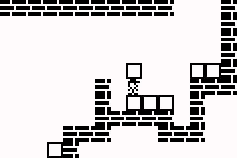
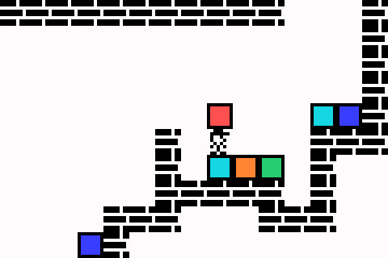

# **blokboi**
A fast sandbox block game for testing strategic AI.

- Python API with C++ backend for speed
- limited rules
- many potential tasks

This game is inspired by Block Dude, made by Brandon Sterner. I originally encountered the game on the TI-84 graphing calculator.

## What makes this game?
blokboi is mostly intended as just a sandbox. This is useful for testing the strategic learning of artificial intelligence.

> in a world with limited rules, your only purpose in life is to move blocks around as you're told.

