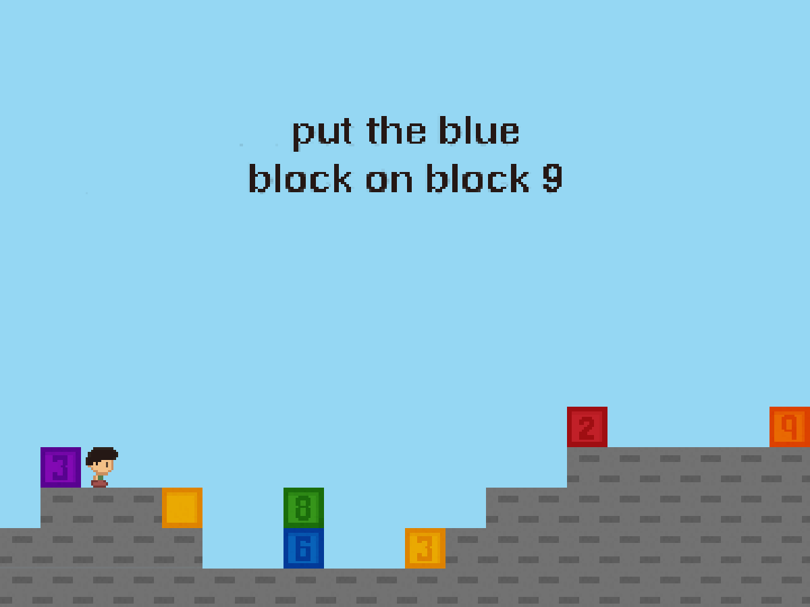

# **blokboi**
A fast sandbox block game for testing strategic AI.

- Python API with C++ backend for speed
- limited rules
- many potential tasks

This game is inspired by Block Dude, made by Brandon Sterner. I originally encountered the game on the TI-84 graphing calculator.


## What makes this game?
blokboi is mostly intended as just a sandbox. This is useful for testing the strategic learning of artificial intelligence.

> in a scene with limited rules, your only purpose in life is to move blocks around as you're told.

Here's an example of how the game would look, *animated by hand* (instruction heading added).



# Installation
This repository uses the several C++ packages as submodules. To clone *Blokboi* and the submodules such as *Loguru*, run the following:
```bash
git clone --recurse-submodules -j8 git@github.com:glxiia/blokboi
```

Or, if you have already cloned the repo, the submodules can be loaded with:
```bash
git submodule update --init --recursive
```

[logurugit]: https://github.com/emilk/loguru
